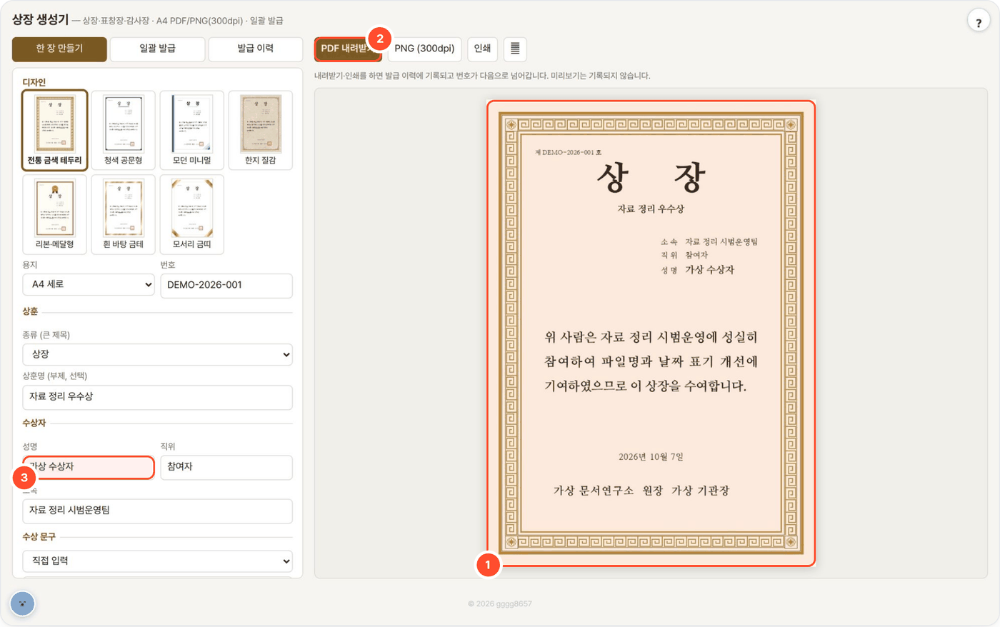

# award-local — 상장·표창장·감사장 생성기

> 디자인과 수상 문구를 고르면 A4 상장을 실시간으로 미리 보여 주고, 인쇄용 PDF·PNG(300dpi)로 발급합니다. 여러 명은 표 붙여넣기·CSV·XLSX로 일괄 발급합니다.



## 무엇을 하나

- 디자인 7종(전통 금색 테두리 · 청색 공문형 · 모던 미니멀 · 한지 질감 · 리본·메달형 · 흰 바탕 금테 · 모서리 금띠), A4 세로/가로.
- 상훈 종류(상장·표창장·감사장·공로상·우수상·직접 입력)별 기본 수상 문구 5~6개 중 고르거나 직접 씁니다. 로컬 LLM이 있으면 직접 쓴 문구를 상장 문체로 다듬습니다(선택).
- 직인은 기관명 글자로 자동 생성(사각·원형)하거나 이미지를 올립니다(흰 바탕은 투명 처리). 기관 마크도 올릴 수 있습니다.
- 내려받기·인쇄를 하면 발급 이력에 기록되고 번호가 다음으로 넘어갑니다. 미리보기는 기록되지 않습니다.
- 나눔명조·나눔고딕(OFL)을 동봉했고, 테두리·메달·한지 질감·직인은 코드로 그립니다. CDN·외부 통신이 없습니다.

## 사용 방법

화면의 번호: **①** 상장 미리보기 · **②** 파일 발급(PDF·PNG·인쇄) · **③** 수상자 입력

1. **디자인과 상훈을 고른다** — 디자인, 세로/가로, 번호(이력 기준 다음 번호가 자동으로 채워짐), 상훈 종류와 부제를 정합니다.
2. **수상자와 문구를 넣는다 (③)** — 성명·소속·직위를 넣고 기본 문구를 고르거나 직접 씁니다. 수여일·기관·수여자와 직인·마크도 설정합니다.
3. **미리보고 발급한다 (① → ②)** — 미리보기를 확인한 뒤 PDF·PNG를 내려받거나 인쇄합니다. 여러 명은 **일괄 발급** 탭에서 표 붙여넣기·CSV·XLSX로 발급합니다(PDF 한 파일 또는 사람별 ZIP). 지난 발급본은 **발급 이력** 탭에서 다시 받습니다.

## 예시

가상 기관·수상자로 실제 발급한 사례입니다.

입력:

```text
수상자: 가상 수상자 · 자료 정리 시범운영팀
상훈:   자료 정리 우수상
번호:   DEMO-2026-001
기관:   가상 문서연구소
문구:   위 사람은 자료 정리 시범운영에 성실히 참여하여 파일명과 날짜 표기 개선에
        기여하였으므로 이 상장을 수여합니다.
```

출력: `상장_가상_수상자.pdf` — A4 세로 · 전통 금색 · 직인 없음 · 수여일 2026년 10월 7일 (위 화면의 미리보기와 같은 그림)

> PDF는 300dpi 이미지로 만든 문서라 글자 선택·검색이 되지 않습니다. 인쇄할 때는 배율을 실제 크기(100%)로 맞추세요.

## 설치·실행

```bash
bash setup.sh                 # Python → Pillow(없으면 venv) → LLM 탐색(선택) → selftest → http://localhost:8779
bash setup.sh stop
python3 app.py                # 수동 실행
python3 app.py --cli cfg.json out.pdf     # 설정 JSON 으로 한 장 (out.png 이면 PNG)
python3 selftest.py           # LLM 없이 검증 (WORKSPACE 를 임시 폴더로 바꿔 돌고 지움)
```

[agent-page-portal](https://github.com/gggg8657/agent-page-portal)에서 띄우면 포털이 포트(8779)·`WORKSPACE`·LLM 설정(로컬 Ollama `gemma4:31b`)을 넣어 줍니다.

| 환경변수 | 기본 | 설명 |
|---|---|---|
| `PORT` | `8779` | |
| `WORKSPACE` | `./_workspace` | 발급 이력 `history.jsonl`, 발급본 `issued/*.pdf`, 올린 로고·직인 `uploads/` |
| `LLM_API` / `LLM_BASE_URL` / `LLM_MODEL` | `ollama` / `http://localhost:11434` / `qwen3:8b` | '상장 문체로 다듬기'에만 씀. 포털 실행 시 로컬 Ollama `gemma4:31b`. LLM이 없으면 그 버튼만 꺼짐 |
| `LLM_API_KEY` | (없음) | OpenAI 호환 서버용(선택) |

## API

| 메서드 | 경로 | 설명 |
|---|---|---|
| GET | `/api/health` · `/api/meta` · `/api/models` | 상태 · 디자인/문구 목록 · LLM 모델 |
| GET | `/api/history` · `/api/issued/<id>.pdf` · `/api/thumb/<디자인>.jpg` | 발급 이력 · 지난 발급본 · 디자인 견본 |
| POST | `/api/preview` | 미리보기 이미지 (기록 안 함) |
| POST | `/api/issue` | PDF·PNG 발급 (이력 기록, `rows` 를 주면 일괄 발급) |
| POST | `/api/rows` | 붙여넣은 표·CSV 텍스트 또는 XLSX 를 수상자 목록으로 읽기 |
| POST | `/api/upload` · `/api/polish` | 로고·직인 업로드 · 문구 다듬기(LLM) |

## 구조

`render.py`(Pillow 렌더러 — 미리보기·PNG·PDF가 같은 그림), `phrases.py`(종류별 기본 문구), `app.py`(stdlib HTTP), `ui.html`, `static/fonts/`.

폐쇄망: 폴더를 통째로 복사합니다. Pillow가 없는 서버면 `wheels/`에 pillow 휠을 넣어 두면 오프라인 설치됩니다.

## 출처·감사 (Credits)

- 동봉: 나눔명조·나눔고딕 (Copyright (c) 2010 NHN Corporation, SIL Open Font License 1.1, `static/fonts/OFL.txt`) — 출처 [google/fonts](https://github.com/google/fonts/tree/main/ofl)
- [Pillow](https://github.com/python-pillow/Pillow) (HPND) — 렌더링 (pip 의존성, 동봉 안 함)
- 테두리·문양·직인은 모두 코드로 그립니다. 실존 기관의 로고·직인은 들어 있지 않습니다.
- **LLM 실행** — OpenAI 호환 API 또는 Ollama API로 호출합니다(모델 가중치는 동봉하지 않음). 기본 배포는 [Ollama](https://github.com/ollama/ollama) (MIT) 위의 Google [Gemma](https://ai.google.dev/gemma) `gemma4:31b` — 모델 이용 조건은 Gemma 배포처 참고.
- 이 도구는 [agent-page-portal](https://github.com/gggg8657/agent-page-portal)에 연결해 쓰도록 만들었습니다(단독 실행도 됨).

저작권 표기·전체 목록은 `NOTICE`를 보세요.

## 라이선스

MIT License — Copyright (c) 2026 gggg8657. `LICENSE` 참고.
